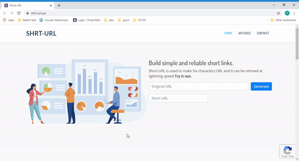

<div align="center">
    <h2>Shorten Bulky Links</h2>
    <h1>Shrt-URL</h1>
    <h4>Build simple and reliable short links.</h4>
</div>

<p align="center">
    <a href = "#about">About</a> |
    <a href = "#features">Features </a> |
    <a href = "#api">API</a> |
    <a href = "#installation">Installation</a> |
    <a href = "#license">License</a> 
</p>

## About
> Short-URL is used to make six characters URL and it can be retrived at lightning speed. [Try it out.](  https://shrt-url.xyz/)

It has an amazing API for getting the click details of each shorturl that has been clicked. 


<p align="center">
  
</p>

## Features

* Built **six** characters long links.
* **TSL** based encryptions for all the URLs.
* RESTful based API to get the click counts.
* API for getting click details which includes its IP, Location and TimeStamp etc.
* API supports searching click details by **city**, **country** or **IP**.
* Google **reCaptcha** is implemented to prevent from bots. 

## API

* #### Get all click details for particular shorturl.
    ```
    https://shrt-url.xyz/api/v1/{shorturl}?skip=0&limit=100
    ```
    **Example:**  {shorturl} = 52ea82r. Try it out [here.](https://shrt-url.xyz)

* #### Get all click details for particular shorturl for past N days.
    ```
    https://shrt-url.xyz/api/v1/{shorturl}/{days}?skip=0&limit=100
    ```
    **Example:**  {shorturl} = 52ea82r *and* {days} = 7. Try it out [here.](https://shrt-url.xyz)

* #### Delete all the details for a url.
    ```
    https://shrt-url.xyz/api/v1/{shorturl}
    ```
    **Example:**  Method:  *DELETE*. Try it out [here.](https://shrt-url.xyz)

* #### Get all the click details by a country for one shorturl.
    ```
    https://shrt-url.xyz/api/v1/{shorturl}/country/{country}
    ```
    **Example:**  {shorturl} = 52ea82r *and* {country} = India. Try it out [here.](https://shrt-url.xyz)


* #### Get all the click details by a city for one shorturl.
    ```
    https://shrt-url.xyz/api/v1/{shorturl}/city/{city}
    ```
    **Example:**  {shorturl} = 52ea82r *and* {city} = Powai. Try it out [here.](https://shrt-url.xyz)


* #### Get all the click details by an IP for one shorturl.
    ```
    https://shrt-url.xyz/api/v1/{shorturl}/ip/{ip}
    ```
    **Example:**  {shorturl} = 52ea82r. Try it out [here.](https://shrt-url.xyz)

* #### Get total click count for one shorturl.
    ```
    https://shrt-url.xyz/api/v1/{shorturl}/totalcount
    ```
    **Example:**  {shorturl} = 52ea82r. Try it out [here.](https://shrt-url.xyz)

* #### Get click count for past N days for one shorturl.
    ```
    https://shrt-url.xyz/api/v1/{shorturl}/totalcount/{days}
    ```
     **Example:**  {shorturl} = 52ea82r. Try it out [here.](https://shrt-url.xyz)

* #### Get total click count from one IP for one shorturl.
    ```
    https://shrt-url.xyz/api/v1/{shorturl}/ip/{ip}/totalcount/
    ```
     **Example:**  {shorturl} = 52ea82r. Try it out [here.](https://shrt-url.xyz)

## Installation
To run the application you need to type below mentioned command.
```bash
go run main.go
```
To successfully run the application you need to set below mentioned environment variables on your system.

```
primaryDB_name = 
primaryDB_host = 
primaryDB_port = 
cacheDB_name =  
cacheDB_host = 
cacheDB_port =
host = 
ipstack_apiKey = Ex: API Key for ipstack
env = DEV
fullchain= Ex: /path/fullchain.pem
privkey= Ex: /path/privkey.pem
privateToken=Ex: Captcha Token.
```

## License
Short-URL is provided under [Apache 2.0](http://www.apache.org/licenses/LICENSE-2.0.html) license. 